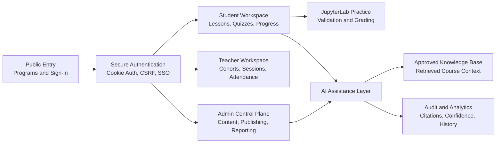
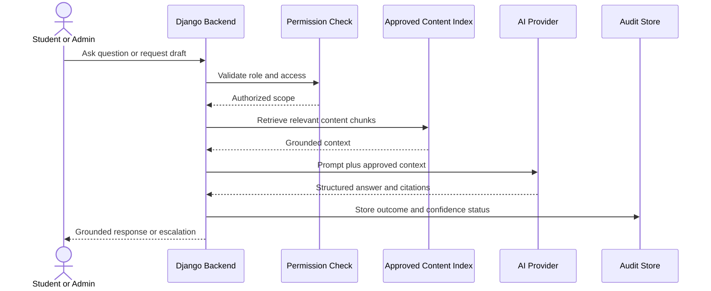
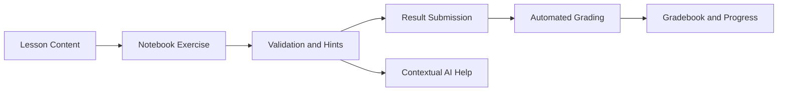

# Learning Hub

### Enterprise AI Learning Platform with Governed Content, Practical Labs, and Auditable Assistance

`Django` `React` `TypeScript` `RAG` `AI Agents` `JupyterLab` `Microsoft SSO` `Secure Auth`

Learning Hub is an enterprise learning platform designed for onboarding, internal academies, role transitions, and measurable upskilling. It combines structured courses, interactive practice, teacher operations, admin governance, and grounded AI assistance in one product architecture.

> This project shows how I approach AI product engineering: connect useful AI workflows to permissions, approved knowledge, security controls, and real operational needs.

---

## Executive Summary

| Product Goal | Engineering Approach | Business Value |
| --- | --- | --- |
| Deliver structured learning at scale | Role-based workspaces for students, teachers, and admins | One platform for learning delivery and operations |
| Make AI assistance reliable | Retrieval from approved course content with citations and fallback behavior | More useful answers with lower hallucination risk |
| Include hands-on validation | JupyterLab exercises, submissions, grading integration | Practice becomes measurable evidence of progress |
| Support enterprise governance | Publishing lifecycle, audit events, secure authentication | Controlled content and traceable activity |

## What I Worked On

My focus was backend and product integration logic across the platform:

- Designed and integrated the AI agent backend workflow.
- Implemented RAG-style retrieval from approved learning content.
- Built provider abstraction and structured AI response handling.
- Supported quiz generation, fallback behavior, and escalation paths.
- Strengthened authentication and browser-side security controls.
- Contributed to auditability, governance, and architecture refinement.
- Shaped learning workflows connecting theory, assessment, and practice.

## The Problem

Enterprise learning platforms often separate the parts that matter most:

- content delivery without practical validation;
- AI chat without approved context or traceability;
- course authoring without governance workflows;
- learner progress without operational visibility.

Learning Hub addresses this by treating learning as a controlled workflow: approved content is delivered, practiced, validated, measured, and supported by AI only within authorized context.

## Solution At A Glance

## Product Experience

### Student Workspace

Learners move through a repeatable lesson journey:

`Theory` -> `Concept` -> `Video` -> `Quiz` -> `Practice` -> `Summary`

The workspace supports course and recording access, active/locked/completed states, progress tracking, AI lesson assistance, calendar entry points, and notebook-based exercises.

### Teacher Workspace

Teachers receive dedicated flows for cohort oversight, sessions, attendance operations, and live teaching support.

### Admin Control Plane

Administrators manage courses, modules, lessons, AI-supported lesson drafting, reporting foundations, and a governed content lifecycle:

`Draft` -> `Review` -> `Approval` -> `Published` -> `Archived`

## AI Architecture: Assistance With Control

The AI capability is an orchestration layer rather than a generic chatbot embedded in the interface.

### AI Use Cases

| Learner Assistance | Admin Course Builder |
| --- | --- |
| Explain lesson concepts using approved material | Generate structured lesson drafts from source material |
| Answer lesson-specific questions with citations | Draft theory, summaries, and quizzes |
| Generate follow-up quiz prompts | Suggest practice tasks and lesson blueprints |
| Escalate when context is insufficient | Keep content inside review and publishing workflows |

### Hallucination Reduction Strategy

- Retrieve only context the user is permitted to access.
- Ground responses in indexed, approved course material.
- Return citations and structured resolution status.
- Record interactions for audit and quality analysis.
- Fall back or escalate instead of inventing an answer when evidence is insufficient.

## Practice And Validation

Selected lessons connect directly to JupyterLab-based exercises. This turns learning into demonstrated capability rather than passive content consumption.

Capabilities include repeatable labs, controlled restart behavior, in-workflow hints, automated grading, and gradebook integration.

## Security And Governance

Security and governance are product requirements in an enterprise learning environment, especially when AI operates on organizational content.

| Area | Implementation Direction |
| --- | --- |
| Authentication | Secure cookie-based access and refresh token handling |
| Browser hardening | Sensitive authentication data removed from `localStorage` |
| Request protection | CSRF protection for cookie-authenticated flows |
| Enterprise access | Microsoft SSO and configured Google sign-in journeys |
| Authorization | Role-based access for learners, teachers, and administrators |
| Governance | Content lifecycle, approval, publishing, and archival states |
| Traceability | AI interaction, quiz, submission, escalation, and audit tracking |

## Technical Profile

| Layer | Technologies And Responsibilities |
| --- | --- |
| Backend | Django APIs, authentication, permission logic, AI orchestration, audit foundations |
| Frontend | React and TypeScript role-based user experiences |
| AI | Provider abstraction, RAG-style retrieval, structured output, citations and fallback |
| Practice Runtime | JupyterLab notebook exercises, validation, submission, grading integration |
| Identity | Secure cookie authentication, CSRF controls, Microsoft SSO, optional Google sign-in |
| Operations | Content governance, publishing workflows, reporting and analytics foundations |

## Engineering Decisions That Matter

### 1. AI is connected to approved content

A course assistant should not respond from uncontrolled context when it supports organizational learning. The platform retrieves authorized course material before a response is generated.

### 2. Practice belongs inside the learning workflow

Notebook exercises, validation, submission, and grading are connected to the learner journey so completion reflects applied skills, not only content views.

### 3. Security is part of usability

Aligned sign-in flows and secure cookie authentication reduce exposure while supporting students, teachers, and admins across their own entry points.

### 4. Governance makes AI adoptable

Approval states, audit events, citations, and escalation behavior make AI-supported learning more suitable for enterprise use.

## Platform Scope

| Domain | Included Capabilities |
| --- | --- |
| Public entry | Program discovery, public course pages, secure sign-in entry points |
| Learners | Dashboard, structured lessons, quizzes, recordings, progress, calendars, AI support |
| Practice | Notebook labs, hints, validation, submissions, automated grading |
| Teachers | Cohorts, sessions, attendance, teaching operations |
| Administrators | Course structure, lesson building, AI drafts, lifecycle governance, reporting |
| Infrastructure | Authentication, integrations, AI orchestration, audit events, analytics |

## Why This Project Is Relevant

Learning Hub demonstrates my ability to work where backend engineering, AI integration, security, and product workflow design meet:

- transforming AI functionality into a permission-aware product capability;
- designing for reliability through retrieval, citations, and escalation;
- connecting practical exercises to measurable learning outcomes;
- building with governance and security requirements in mind;
- balancing learner experience with teacher and administrator operations.

## Next Engineering Steps

- Introduce production-grade embedding and retrieval evaluation pipelines.
- Add systematic AI answer quality, token usage, and cost monitoring.
- Expand human review tooling for AI-generated learning content.
- Strengthen prompt-injection and adversarial content safeguards.
- Deepen analytics for completion, practical performance, and learning outcomes.
- Extend workspace integrations and notebook validation scenarios.

---

### Portfolio Note

This repository presents the product concept, architecture, and my engineering contribution to Learning Hub. Screenshots, API examples, deployment information, and a technical walkthrough can be added as supporting artifacts where project confidentiality permits.
